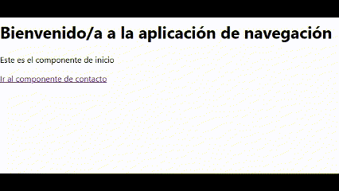

# Ejercicios de práctica
## Importante
Todas las entregas deben realizarse en el foro de tarea correspondiente en el campus de inove, salvo especificarse lo contrario.

## Preparar nuestro entorno de trabajo
Para poder realizar este ejercicio deberá crear un proyecto nuevo, o aprovechar otro que haya utilizado para otro desafio.

## Consigna
Crear una aplicación de navegación con dos componentes: "Home" y "Contact". La página de inicio ("Home") deberá tener un enlace que redirija al componente de contacto ("Contact"), donde se mostrará un formulario para enviar un mensaje. Al enviar el formulario, se mostrará un mensaje de éxito y se podrá volver a la página de inicio.

Aquí tienes los pasos para completar el ejercicio:

Paso 1: Configurar las rutas

1. Crea un archivo llamado "RouterPrincipal.jsx" en la carpeta "Router" (asegúrate de tener instalada la librería "react-router-dom").
2. Importa las siguientes dependencias:

```
import { BrowserRouter, Routes, Route } from "react-router-dom";
import Home from "../views/Home";
import Contact from "../views/Contact";
```

3. Define el componente "RouterPrincipal" y utiliza el enrutador (<BrowserRouter>) con las rutas (<BrowserRouter>):

```
export default function RouterPrincipal() {
  return (
    <BrowserRouter>
      <Routes>
        <Route path="/" element={<Home />} />
        <Route path="/contact" element={<Contact />} />
      </Routes>
    </BrowserRouter>
  );
}

```

Paso 2: Crear los componentes "Home" y "Contact"

1. Crea un archivo llamado "Home.jsx" en la carpeta "views".
   Importa la siguiente dependencia:

```
import { Link } from "react-router-dom";

```

2. Define el componente "Home" y utiliza el enlace (<Link>) para redirigir al componente de contacto:

```
export default function Home() {
  return (
    <div>
      <h1>Bienvenido/a a la aplicación de navegación</h1>
      <p>Este es el componente de inicio</p>
      <Link to="/contact">Ir al componente de contacto</Link>
    </div>
  );
}

```

3. Crea un archivo llamado "Contact.jsx" en la carpeta "views".
4. Importa las siguientes dependencias:

```
import { useState } from "react";
import { Link } from "react-router-dom";

```

5. Define el componente "Contact" y utiliza el estado (useState) para manejar el formulario y el estado de éxito.

Paso 3: Configurar el componente principal "App"

1. Abre el archivo "App.js" e importa el componente "RouterPrincipal".

Con estos pasos, has creado una aplicación de navegación con dos componentes: "Home" y "Contact". Al acceder a la página de inicio, se mostrará el componente "Home" con un enlace al componente de contacto. Al hacer clic en el enlace, se redirigirá al componente de contacto, donde se podrá enviar un mensaje a través del formulario. Después de enviar el formulario, se mostrará un mensaje de éxito y se podrá volver a la página de inicio.

Recuerda asegurarte de que todos los archivos estén en las rutas correctas y de tener instaladas las dependencias necesarias para React y React Router.

## Resultado final

