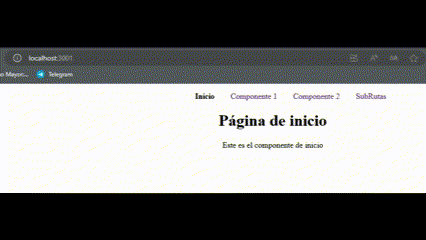

# Ejercicios de práctica
## Importante
Todas las entregas deben realizarse en el foro de tarea correspondiente en el campus de inove, salvo especificarse lo contrario.

## Preparar nuestro entorno de trabajo
Para poder realizar este ejercicio deberá crear un proyecto nuevo, o aprovechar otro que haya utilizado para otro desafio.

## Consigna 2A:
Crear una navegación con subrutas en React utilizando React Router.

Aquí tienes los pasos para completar el ejercicio:

Paso 1: Configuración inicial del proyecto

- Crea un nuevo proyecto de React utilizando Create React App.

- Instala react-router-dom

```
npm install react-router-dom
```

- Importa los componentes necesarios de React Router en los archivos correspondientes.

Paso 3: Crear los componentes de las vistas

- Crea un componente llamado "Home" en el archivo "Home.jsx" dentro de la carpeta "views". Este componente representará la página de inicio y mostrará un título y un párrafo descriptivo.
- Crea un componente llamado "Componente1" en el archivo "Componente1.jsx" dentro de la carpeta "views". Este componente mostrará un título y un párrafo para representar un componente adicional.
- Crea un componente llamado "Componente2" en el archivo "Componente2.jsx" dentro de la carpeta "views". Este componente mostrará un título y un párrafo para representar otro componente adicional.
- Crea un componente llamado "Error404" en el archivo "Error404.jsx" dentro de la carpeta "views". Este componente mostrará un mensaje de error y un enlace para volver a la página de inicio.

Paso 4: Configurar las rutas principales

- Crea un archivo llamado "RouterPrincipal.jsx" dentro de la carpeta "routes".
- En el archivo "RouterPrincipal.jsx", importa los componentes necesarios de React Router y los componentes de las vistas creadas anteriormente.
- Crea un componente llamado "RouterPrincipal" que represente el enrutador principal de la aplicación.
- Dentro del componente "RouterPrincipal", utiliza el componente "BrowserRouter" como contenedor raíz.
- Agrega una barra de navegación con enlaces a la página de inicio, "Componente1", "Componente2" y una ruta de subrutas.
- Configura las rutas principales utilizando el componente "Routes" de React Router. Asocia cada ruta con su componente correspondiente.

Paso 5: Crear subrutas

- Crea una carpeta llamada "subrutas" dentro de la carpeta "views".
- Dentro de la carpeta "subrutas", crea un componente llamado "InicioSubRuta" en el archivo "InicioSubRuta.jsx" que muestre un título para representar la página de inicio de las subrutas.
- Crea un componente llamado "SubRuta1" en el archivo "SubRuta1.jsx" que muestre un título para representar la primera subruta.
- Crea un componente llamado "SubRuta2" en el archivo "SubRuta2.jsx" que muestre un título para representar la segunda subruta.
- Crea un componente llamado "RouterSubRutas" en el archivo "RouterSubRutas.jsx" dentro de la carpeta "routes". Este componente será el enrutador de las subrutas.
- En el componente "RouterSubRutas", crea una navegación con enlaces a la página de InicioSubRuta, "SubRuta1" y "SubRuta2".
- Utiliza el componente "Outlet" de React Router para representar las subrutas dentro del componente "RouterSubRutas".

Paso 6: Configurar las subrutas

- Dentro del componente "RouterPrincipal", agrega una ruta de subrutas utilizando el componente "Route" de React Router.
  -Configura la ruta de subrutas para que apunte a la URL "/subrutas/\*" y utilice el componente "RouterSubRutas".

- Dentro del componente "RouterSubRutas", agrega rutas hijas utilizando el componente "Route" de React Router.
- Configura una ruta para la página de InicioSubRuta ("/inicio"), "SubRuta1" ("/subruta1") y "SubRuta2" ("/subruta2"). Son 3 componentes en total.

Paso 7: Manejar la ruta 404

- Dentro del componente "RouterPrincipal", agrega una ruta comodín ("\*") utilizando el componente "Route" de React Router para manejar la ruta 404.
- Asocia la ruta comodín con el componente "Error404".

Paso 8: Finalizar la app.

- Importa el componente "RouterPrincipal" dentro de App.js

Al finalizar los pasos, aprenderás a crear una navegación efectiva en React utilizando React Router y a implementar subrutas para organizar y estructurar su aplicación de manera más modular. Esto te permitirá construir aplicaciones más complejas con múltiples páginas y rutas, mejorando la experiencia de usuario y facilitando la navegación dentro de la aplicación.

## Resultado final



## Consigna 2B
Una vez finalizado el Ejercicio 2A, crea un componente Persona que capture los parámetros de nombre y apellido desde la URL utilizando React Router. El componente debe mostrar los valores de nombre y apellido y permitir al usuario modificarlos a través de un formulario. Al enviar el formulario, se redireccionará al usuario a la misma página pero con los nuevos valores de nombre y apellido.

Pasos a seguir:

1. Configura las rutas en el componente RouterPrincipal:

- Crea las rutas '/persona/:nombre/:apellido', '/persona/:nombre/' y '/persona/' y asigna el componente Persona a cada una de ellas.
- Añade una ruta adicional '/navegar' que redirigirá al usuario a la ruta '/persona/TuNombre/TuApellido' utilizando el componente Navigate de React Router.

2.  Crea el componente Persona:

- Importa los módulos useNavigate y useParams desde 'react-router-dom'.
- Declara el componente Persona.
- Utiliza useParams para obtener los valores de nombre y apellido de los parámetros de la URL. Establece valores por defecto en caso de que los parámetros no estén presentes.
- Define la función handleSubmit que manejará el envío del formulario. Deberás capturar los valores ingresados por el usuario.Dentro de esta función, utiliza useNavigate para redirigir al usuario a la ruta '/persona/nombre/apellido' con los nuevos valores.
- En el renderizado del componente, muestra los valores de nombre y apellido y configura un formulario para capturar los nuevos valores. Al enviar el formulario, se llamará a la función handleSubmit.
- Dentro de la función handleSubmit, utiliza e.preventDefault() para evitar que la página se recargue al enviar el formulario.
- Añade un botón de reset para limpiar los campos del formulario.

3. En el componente de navegación (RouterPrincipal):

- Agrega un enlace de navegación hacia la ruta '/persona' en el menú de navegación.

Al finalizar el ejercicio, habrás aprendido a utilizar React Router para capturar parámetros de la URL, redireccionar al usuario y actualizar dinámicamente los componentes en base a los cambios en la URL. También habrás practicado el uso de los hooks useNavigate y useParams proporcionados por React Router

## Resultado final


